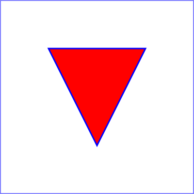

# go-svg

[](https://pkg.go.dev/github.com/twpayne/go-svg)

Package `svg` provides convenience methods for creating and writing SVG documents.

## Key Features

* Fluent API for building arbitrarily complex SVG documents.
* Support for all SVG elements.
* Support for all SVG units.
* Compatibility with the standard library's [`encoding/xml`](https://pkg.go.dev/encoding/xml) package.
* Simple mapping between functions and SVG elements.

## Example

```go
func ExampleNew() {
    svgElement := svg.New().WidthHeight(4, 4, svg.CM).ViewBox(0, 0, 400, 400).AppendChildren(
        svg.Title(svg.CharData("Example triangle01- simple example of a 'path'")),
        svg.Desc(svg.CharData("A path that draws a triangle")),
        svg.Rect().XYWidthHeight(1, 1, 398, 398, svg.Number).Fill("none").Stroke("blue"),
        svg.Path().D(svgpath.New().
            MoveToAbs([]float64{100, 100}).
            LineToAbs([]float64{300, 100}).
            LineToAbs([]float64{200, 300}).
            ClosePath(),
        )).Fill("red").Stroke("blue").StrokeWidth(svg.Number(3)),
    )
    if _, err := svgElement.WriteToIndent(os.Stdout, "", "  "); err != nil {
        panic(err)
    }
}
```

Output:

```xml
<svg height="4cm" version="1.1" viewBox="0 0 400 400" width="4cm" xmlns="http://www.w3.org/2000/svg">
  <title>Example triangle01- simple example of a &#39;path&#39;</title>
  <desc>A path that draws a triangle</desc>
  <rect fill="none" height="398" stroke="blue" width="398" x="1" y="1"></rect>
  <path d="M100,100 L300,100 L200,300 z" fill="red" stroke="blue" stroke-width="3"></path>
</svg>
```



## License

MIT
